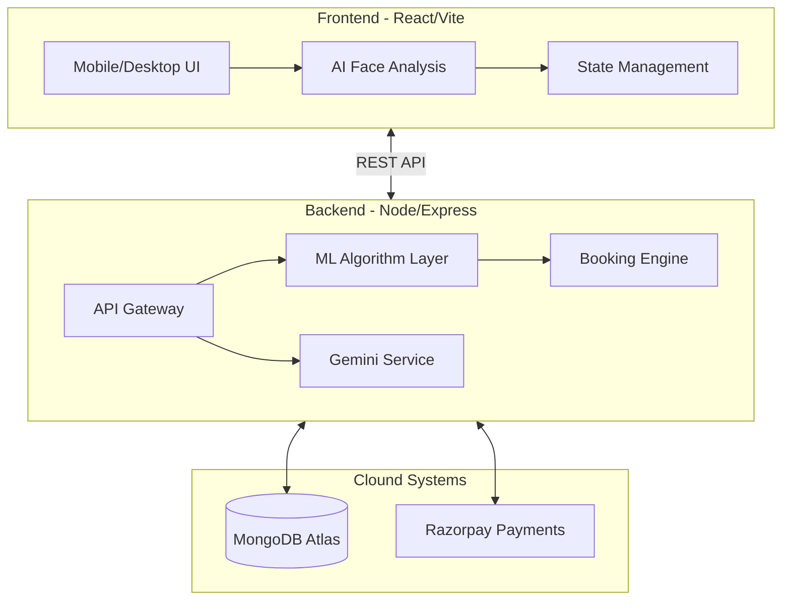

# ✂️ BookSaloonz - Premium AI-Powered Salon Ecosystem

<div align="center">

[](#)
[](#)
[](#)
[](#)
[](#)

**A professional, full-stack MERN application revolutionizing the grooming industry with Artificial Intelligence.**

[🚀 Explore Live Demo](https://booksaloonz.netlify.app/) • [📂 View Backend API](#) • [👨‍💻 Documentation](#)

</div>

---

## 📸 Project Preview
*(Add your stunning project banner or GIF here)*

---

## 🌟 Why BookSaloonz?

In a world where personalization is key, **BookSaloonz** isn't just a booking platform—it's a smart grooming companion. Developed as a final year capstone project, it demonstrates the seamless integration of modern web technologies with machine learning to solve real-world scheduling and styling challenges.

### What It Solves:
We bridge the gap between premium salons and style-conscious customers by:
1.  **Automating Choices**: No more guessing. Our AI tells you what style fits your face shape.
2.  **Optimizing Time**: Our smart scheduler minimizes salon downtime using intelligent evaluation logic.
3.  **Enhancing Discovery**: Natural language search that understands intent, not just keywords.

---

## 🚀 Key Features

### 👤 For Customers
*   **🤖 AI Hairstyle Finder**: Upload a photo and let our **TensorFlow.js** model analyze your face shape. Get personalized recommendations powered by **Google Gemini**.
*   **🧠 BERT-Powered Search**: Don't just search for "Haircut". Search for "Something stylish for a wedding" and our NLP layer understands the context.
*   **📅 Seamless Booking**: Real-time availability with instant confirmation and Razorpay integration.
*   **🛍️ Grooming Marketplace**: Discover and purchase professional-grade products used by your favorite stylists.

### 🏢 For Salon Partners
*   **📊 Dynamic Dashboard**: Real-time analytics on revenue, bookings, and product sales.
*   **🧠 DQN Slot Optimizer**: A Deep Q-Network inspired algorithm that prioritizes bookings to eliminate "dead time" in the salon schedule.
*   **📦 Inventory Management**: Professional toolkit for managing services, staff, and products.
*   **🔔 Smart Notifications**: Stay updated with real-time push notifications for new bookings.

---

## 🛠️ Cutting-Edge Tech Stack

| Layer | Technology | Rationale |
| :--- | :--- | :--- |
| **Frontend** | React 18 + Vite | Component-driven architecture with blazing-fast HMR. |
| **Backend** | Node.js + Express | Event-driven, scalable RESTful API. |
| **Database** | MongoDB + Mongoose | Schema-flexibility for complex salon profiles. |
| **AI (Vision)** | face-api.js (TensorFlow) | Client-side facial landmark detection for privacy and speed. |
| **AI (LLM)** | Google Gemini Pro | Contextual style analysis and natural language processing. |
| **Styling** | Vanilla CSS | Custom design system with a premium, futuristic aesthetic. |
| **Payments** | Razorpay | Secure, industry-standard payment gateway integration. |

---

## 🧠 High-Performance Algorithms

This project goes beyond standard CRUD operations by implementing custom logic:

1.  **Semantic Similarity (`bertSearch.js`)**: Uses vector space modeling to rank salon relevance based on user intent.
2.  **Reinforcement Learning Logic (`dqnSlot.js`)**: Evaluates the "reward" of filling specific time slots to maximize daily salon throughput.
3.  **Neural Collaborative Filtering (`ncfRecommend.js`)**: Learns from user behavior to suggest salons you'll actually like.

---

## 🏗️ Technical Architecture



---

## 📱 Mobile-First Excellence

BookSaloonz is built with a **fluid design system**. Every component—from the complex Partner Dashboard to the AI Tracker—is optimized for:
*   ✓ Ultra-wide Desktop Monitors
*   ✓ Tablets (Landscape/Portrait)
*   ✓ Modern Smartphones (All aspect ratios)

---

## 🚀 Getting Started

### Prerequisites
- Node.js (v18+)
- MongoDB Atlas account
- Google Gemini API Key

### Installation

1.  **Clone the Repo**
    ```bash
    git clone https://github.com/MohamedThoufiq07/booksaloonz-final-year-project.git
    cd booksaloonz-final-year-project
    ```

2.  **Environment Setup**
    Create a `.env` in the backend folder:
    ```env
    MONGO_URI=your_uri
    JWT_SECRET=your_secret
    GEMINI_API_KEY=your_key
    ```

3.  **Install & Run**
    ```bash
    # Backend
    cd "booksaloonz backend"
    npm install
    npm run dev

    # Frontend (in another terminal)
    cd "booksaloons frontend"
    npm install
    npm run dev
    ```

---

## 📄 License & Credits

Distributed under the MIT License. Developed with ❤️ by **Mohamed Thoufiq**.

---

<div align="center">
  <h3>✨ Built for the Future of Grooming ✨</h3>
</div>
