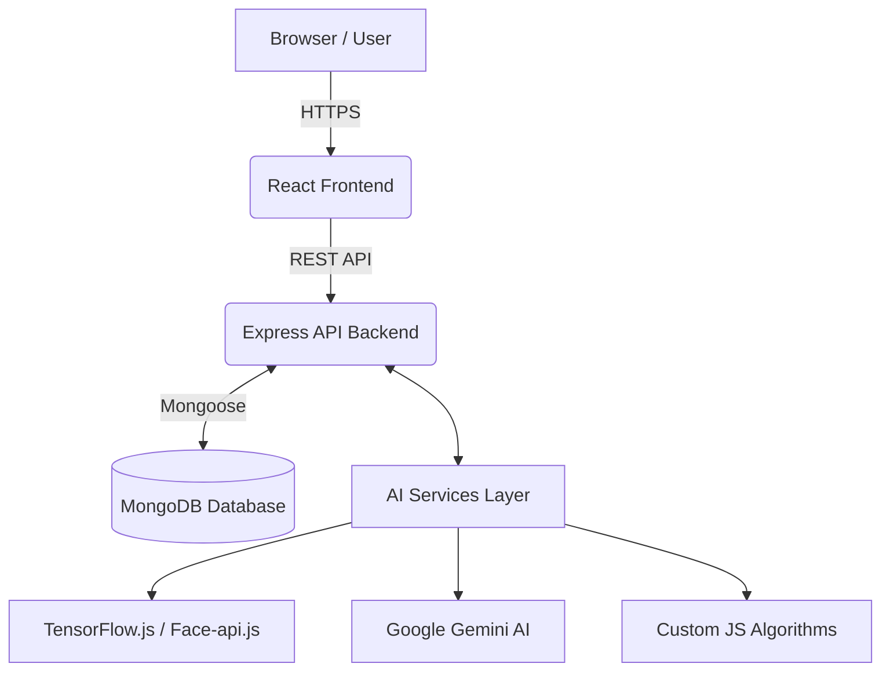

# ✂️ BookSaloonz - Premium AI-Powered Salon Pre-Booking System

<div align="center">

[](#)
[](#)
[](#)
[](#)
[](#)
[](#)

<br/>

[](https://booksaloonz.netlify.app/)

</div>

---

## 📸 Screenshots
<!-- Add screenshot here -->

## 📝 About the Project
**BookSaloonz** is an advanced, full-stack web application designed to revolutionize the grooming industry. It bridges the gap between premium salons and style-conscious customers through intelligent scheduling, AI-driven style recommendations, and data-backed performance ranking.

---

## 🌟 Features
*   **🤖 AI Hairstyle Finder**: Analyzes face shapes using TensorFlow.js and recommends flattering styles.
*   **🧠 Intelligent Search**: Custom NLP-backed search engine for a natural, typo-tolerant search experience.
*   **📅 Smart Slot Booking**: DQN-inspired algorithm optimizes available slots to minimize salon downtime and maximize user convenience.
*   **💇‍♂️ Personal Hair Tracker**: A digital grooming diary with AI insights into hair health and styling history.
*   **🏢 Salon Management**: Dedicated provider portal to manage bookings, services, products, and analytics.
*   **🛍️ Product Marketplace**: Integrated shop to discover and purchase professional grooming products.

---

## 🏗️ Architecture Overview



*Text representation:*
`Browser → React Frontend (Vite) → Express API (Node.js) → MongoDB`
*(Plus an integrated AI Layer handling face analysis and complex booking/ranking logic)*

---

## 🛠️ Tech Stack

| Category | Technology | Purpose |
| :--- | :--- | :--- |
| **Frontend** | React.js + Vite | Blazing fast client-side rendering & component architecture. |
| **Backend** | Node.js + Express.js | Scalable, event-driven RESTful API server. |
| **Database** | MongoDB + Mongoose | Flexible document storage for users, salons, and bookings. |
| **AI (Vision)** | TensorFlow.js / face-api.js | Real-time facial landmark detection and shape classification. |
| **AI (Generative)**| Google Gemini AI | Advanced contextual analysis via `geminiService.js` / `geminiClient.js`. |
| **Deployment** | Docker & Netlify | Containerized backend support (`Dockerfile`) and frontend hosting. |

---

## 🧠 Core AI Algorithms

*   **BERT Semantic Search (`bertSearch.js`)**: Understands context and synonyms (e.g., "cutting" vs "styling") rather than just exact keyword matches.
*   **DQN-Inspired Booking (`dqnSlot.js`)**: A reinforcement learning approach that evaluates and prioritizes time slots to reduce dead time for salons.
*   **Neural Collaborative Filtering (`ncfRecommend.js`)**: Suggests salons and products based on complex user behavior patterns and preferences.
*   **Learning to Rank (`ltrRanking.js`)**: Dynamically orders search results to prioritize high-quality, relevant salons for the user.

---

## ⚙️ Environment Variables

Create a `.env` file in both the frontend and backend directories.

### Backend (`/booksaloonz backend/.env`)
```env
PORT=5000
MONGO_URI=your_mongodb_connection_string
JWT_SECRET=your_jwt_secret_key
GEMINI_API_KEY=your_google_gemini_api_key
# Other keys for Email/Payment if integrated (e.g., Razorpay, Nodemailer)
```

### Frontend (`/booksaloons frontend/.env`)
```env
VITE_API_URL=http://localhost:5000/api
```

---

## 🚀 Getting Started

### Prerequisites
- Node.js (v18.x recommended)
- MongoDB (Running locally or MongoDB Atlas)

### 1. Clone the Repository
```bash
git clone https://github.com/MohamedThoufiq07/booksaloonz-final-year-project.git
cd booksaloonz-final-year-project
```

### 2. Install Dependencies
You can install them individually:

**Backend:**
```bash
cd "booksaloonz backend"
npm install
```

**Frontend:**
```bash
cd "booksaloons frontend"
npm install
```

*(Or use the root script if provided: `npm run install-all`)*

### 3. Run the Application
Start the backend server:
```bash
cd "booksaloonz backend"
npm run dev
```

Start the frontend server (in a new terminal):
```bash
cd "booksaloons frontend"
npm run dev
```

Visit `http://localhost:5173` to see the app in action!

*(Note: The backend is also Docker-ready. A `Dockerfile` is included for easy containerized deployment.)*

---

## 📂 Project Structure

```text
final-year-project/
├── booksaloons frontend/      # Frontend application
│   ├── src/
│   │   ├── components/        # UI components (NearbySalons, AIHairTracker, etc.)
│   │   ├── context/           # Global state (AuthContext, CartContext)
│   │   ├── pages/             # Route pages (Home, Salons, Dashboard, Auth)
│   │   ├── services/          # Client-side API interactions
│   │   └── utils/
│   └── package.json
│
├── booksaloonz backend/       # Backend API & AI logic
│   ├── algorithms/            # 🧠 Core ML Logic
│   │   ├── bertSearch.js      # Semantic search engine
│   │   ├── dqnSlot.js         # DQN-inspired slot optimizer
│   │   ├── ncfRecommend.js    # Neural Collaborative Filtering
│   │   └── ltrRanking.js      # Learning to Rank
│   ├── controllers/           # Business logic for routes
│   ├── middleware/            # Security & Auth (JWT, Role guards)
│   ├── models/                # Mongoose Database Schemas
│   ├── routes/                # Express API endpoint definitions
│   ├── services/              # ⚙️ External integrations
│   │   ├── geminiService.js   # Google Gemini AI functions
│   │   ├── faceAnalysisService.js
│   │   └── searchService.js
│   ├── Dockerfile             # Container configuration
│   ├── geminiClient.js        # Gemini AI Client setup
│   └── index.js               # Application Entry Point
```

---

## 🛣️ API Routes Summary

| Endpoint Area | Description |
| :--- | :--- |
| `/api/auth` | User/Salon registration, login, and JWT token management. |
| `/api/salons` | Salon discovery, nearby searches, and profile updates. |
| `/api/bookings` | Appointment scheduling, DQN slot retrieval, and status updates. |
| `/api/products` | E-commerce product listings and management. |
| `/api/hair-style` | Generative image analysis and tracking logic. |
| `/api/ai` | Dedicated endpoints for Gemini and Face-api.js data processing. |

---

## 📄 License
This project is licensed under the **MIT License**.

---

## 👨‍💻 Contributor
- **Mohamed Thoufiq** - *Full Stack Developer & AI Enthusiast*

---
✨ *This project was developed as a Final Year Engineering Project to demonstrate the integration of Modern Web Technologies with AI/ML concepts.*
